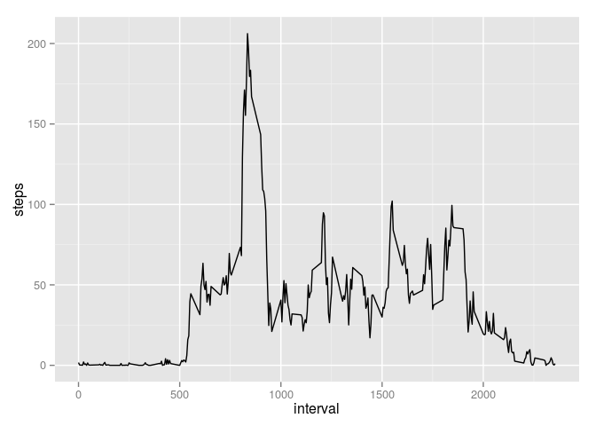

# Reproducible Research: Peer Assessment 1


## Loading and preprocessing the data

```r
## Cargando librerías

# Cargando data
data <- read.csv("activity.csv", header=TRUE, 
                     colClasses = c('numeric', 'character', 'numeric'))
```


## What is mean total number of steps taken per day?

```r
library(reshape2)
date_data <- melt(data[,c('steps', 'date')], id = c('date'))
date_steps <- dcast(date_data, date ~ variable, sum)
library(ggplot2)
qplot(steps, data=date_steps)
```

 


```r
# Computes mean and median steps taken per day.
mean1 <- mean(date_steps$steps, na.rm=TRUE)
median1 <- median(date_steps$steps, na.rm=TRUE)
mean1
```

```
## [1] 10766.19
```
* Mean number of steps taken per day: 1.0766189\times 10^{4} steps 
* Median number of steps taken per day: 1.0765\times 10^{4} steps.


## What is the average daily activity pattern?

```r
interval_data <- melt(data[, c('steps', 'interval')], id = c('interval')) 
interval_steps <- dcast(interval_data, interval ~ variable, mean, na.rm = TRUE)
qplot(interval, steps, data = interval_steps, geom='line')
```

 


```r
#  Finds the interval with the maximum number of average steps.
interval_steps[which.max(interval_steps[, c('steps')]),]$interval
```

```
## [1] 835
```
## Imputing missing values

```r
# Computes the total number of incomplete cases in the dataset.
sum(is.na(data$steps))
```

```
## [1] 2304
```


```r
library(plyr)
setMissingSteps <- function(data) {
        if (is.na(data$steps)) {
                data$steps <- interval_steps[interval_steps$interval == 
                                                     data$interval, ]$steps
                }
        data
}
data_without_missing <- adply(data, 1, setMissingSteps)

# Aggregates steps by date.
date_nomissing_data <- melt(data_without_missing[,c('steps', 'date')], 
                            id = c('date'))
date_nomissing_steps <- dcast(date_nomissing_data, date ~ variable, sum)
qplot(steps, data=date_nomissing_steps)
```

 

```r
# Computes mean and median steps taken per day
mean(date_nomissing_steps$steps)
```

```
## [1] 10766.19
```

```r
median(date_nomissing_steps$steps)
```

```
## [1] 10766.19
```


## Are there differences in activity patterns between weekdays and weekends?

```r
data_without_missing$dayofweek <- as.POSIXlt(data_without_missing$date)$wday
data_without_missing$dayofweek <- sapply(data_without_missing$dayofweek, 
                                         function(day) {
                                                 if (day == 0 || day == 6) {
                                                         'weekend'
                                                 } else {
                                                         'weekday'
                                                 }
                                         })
data_without_missing$dayofweek <- as.factor(data_without_missing$dayofweek)

meltdata <- melt(data_without_missing[,c('steps', 'interval', 'dayofweek')],
                 id = c('dayofweek','interval'))
plotdata <- dcast(meltdata, interval + dayofweek ~ variable, mean)

g <- ggplot(plotdata, aes(interval, steps))
g + geom_line() + facet_grid(dayofweek ~ .) + 
        labs(y = 'Number of steps') + labs(x = 'Interval')
```

 

Yes, there are differences, the persons is more active on weekends 
